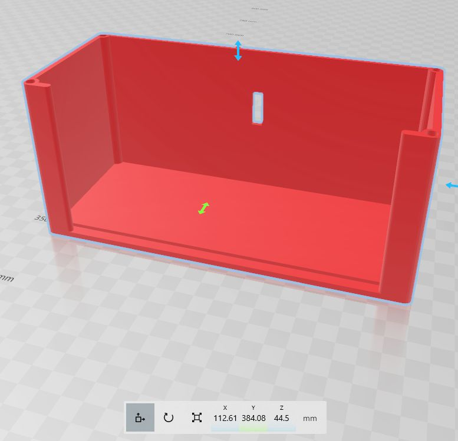
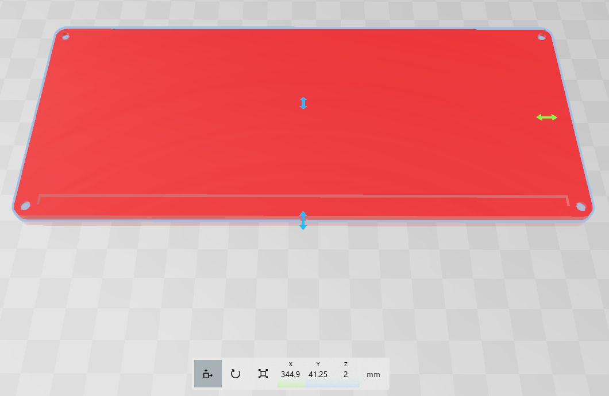
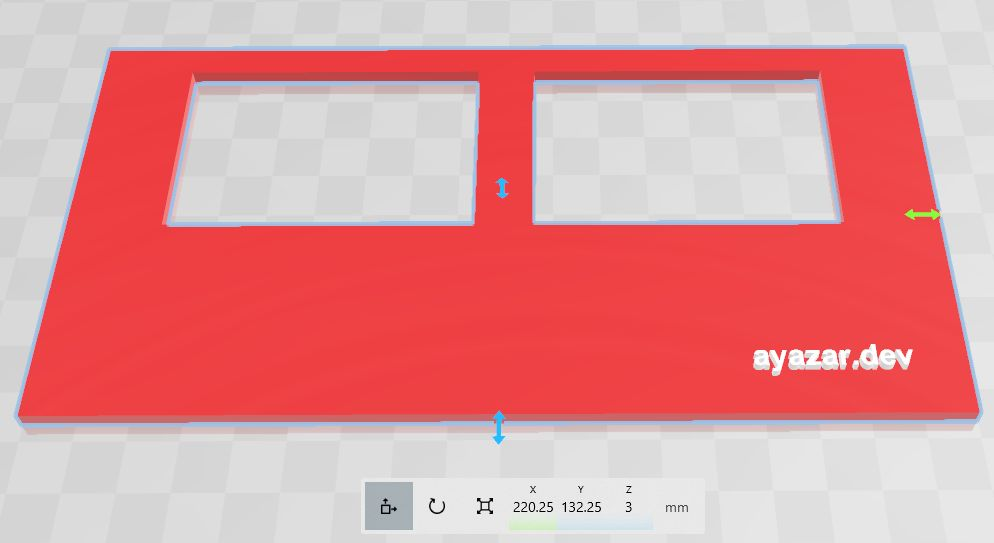
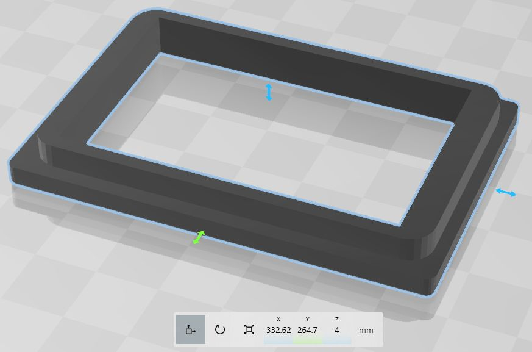

# 3D

Here, `.stl` files required to print the v2, 2023 box design by a 3D printer are given. The box was designed by my friend, [Erdal Mehmetcik](https://www.linkedin.com/in/erdal-mehmetcik-7470363a/).

- `body.stl`

- `bottom.stl`

- `front.stl`

- `eye.stl`

