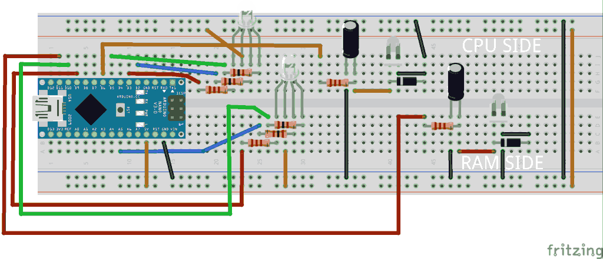
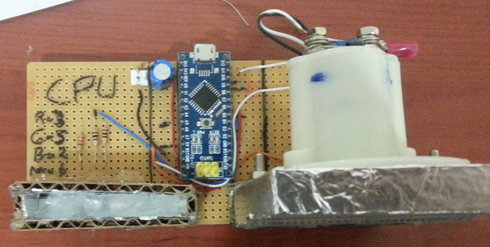

# How to build your own aPCmeter

First of all, **please download project files from the link given in the main project page:** [http://www.alperyazar.com/r/aPCmeter](http://www.alperyazar.com/r/aPCmeter). You should look into relevant folders when you need.

## Analog gauges

Firstly, you should find two propoer analog gauges for this project. This may be the hardest part to find. Appereance of gauges isn't important. Since the Arduino board will apply a voltage between 0 - 5V, gauges should handle this range. I used 5V analog voltmeters but if you couldn't find a 5V voltmeter you may still use what you find. Because most of high range meters have internal voltage dividers. You can modify the range if you play those internal resistor.

I bought couple of gauges from Aliexpress: [http://www.aliexpress.com/item/HOT-SALE-E-Direct-Current-0-5-V-White-Voltmeter-Analog-Panel-Meter/32521001902.html](http://www.aliexpress.com/item/HOT-SALE-E-Direct-Current-0-5-V-White-Voltmeter-Analog-Panel-Meter/32521001902.html). Unfortunately the product page is not available at this moment. Here is the screenshot of the page when I order it:

***

***

As I said, there is no single gauge that is only suitable for aPCmeter project. You are free to select anything you want as long as it works as a 5V DC voltmeter panel.

Meters arrived within a month.

***

***

Next, I designed custom labels. You can find necessary files under "Gauge" folder. Please read the "Readme.md" file. It is very easy to disassemble gauges.

***

***

You don't need to open the back to modify label actually. As you can see, there is a current limiting resistor. Let's remove the front panel.

***

***

You can use the front and just paste the custom label on it. I prefered to use the back of the panel. I flipped the panel and scratched surface little bit by sandpaper to provide better surface for glue.

***

***

I used standard A4 paper to print the label. An ordinary paper glue like Pritt is suitable. Let's apply glue.

***

***

Let's paste our custom label. Dimension of my panel is 60mm x 35mm.

***

***

Let's flip the panel and remove the excess paper using knife or something like it.

***

***

After cutting excess paper, it looks like this:

***

***

As final step, let's reassemble the guage. Our RAM meter is ready to use now! You should repeat these steps to build CPU meter. 

***

***

You can test meter by using the Arduino code itself or a seperate power supply. For example:

***

***

## Arudino based circuit

aPCmeter board consists of Arduino Nano 3.0 + some simple components. You should look at "Board" folder for details. As a reference, here is the my recommended circuit schematic:

***

***

Although I built my aPCmeter using perfboard, I prepared an example layout for breadboard.

***

***

The schematic is straightforward. First, I soldered the CPU part and both LEDs as shown in below. Dimension of my perfboard is 125mm x 60mm.

***

***

I checked the LEDs next. Notice that light is not diffused very well. This may be a problem when a gauge is illuminated by both red and green LED to obtain a yellow light. We will do something for diffusion later on.

***

***

Later I finished the remaining parts of the circuit. I glued (Pritt) piece of aluminium foil around LED and around the meter to improve light reflectivity and to avoid light interference between two gauges. I connected diodes accross terminal of gauges directly. I also prefered to use connectors for gauges.

***

***

Board is almost complete but do you remember the light diffisuion issue? My plan was to illimunate gauges from bottom. Gauge should be illuminated uniformly. This is necessary to obtain secondary colors like yellow properly. I found transparent paper holders around my desk and decided to give a try. They were transparent but had rough surfaces which might provide enough diffusion. I placed couple of paper holders between LED and gauge. You can see the result here for a test pattern. It looks fine.

***

***

I took a piece of cardboard and pasted a piece of aluminium foil on one side using a paper glue (Pritt). Then, I cutted into 4 pieces. I prepared one set for each meter.

***

***

I glued cardbords around  LEDs to construct a support for meters using hot glue. Foil glued sides should face to LED. I cut small pieces from paper holders and strewed inside support. Finally I glued meters on top of support using hot glue. Here is an example picture. Notice the small pieces inside at the leftmost support. Can you notice a LED? :)

***

***

As I said before, I used piece of paper holder as light diffuser. Here is the standard paper holder that I used.

***

***

Finally a test pattern works well.

***

***

## Wood case

This is the most improvised part of the project. I just built a crude wooden box. You can find my cutting layout under "Wood" directory. Here is the quick reference.

***

***

I cutted 6 pieces of wood using the given sketch.

***

***

I chose to build the box in a modular fashion. Instead of glue, I preferred using bracktes and screws to build the box. I drilled holes and screwed brackets.

***

***

***

***

Then I finished all bracktes of the bottom side.

***

***

After drilling all holes necessary for brackets at the bottom, I mounted the board using three screws.

***

***

I added paper holder between perfboard and screws as an insulation layer to protect circuit from deadshorts.

***

Then, I completed the remaning sides in a similar way. Now, it is ready to close the box.

***

Notice that I am using nuts and bolts (trademark warning!) to attach panels together with help of brackets. I held a nut with my hand and tightened bolt with my otherhand. However once I closed the box completely, I couldn't hold nut. Therefore I applied hot glue to nuts (There are 6 of them.) corresponding to screws at the bottom. By this way I was able to tighten the bottom screws without any problem. Once I open the box from using the bottom screws, again I can my other hand to hold other nuts. There is no need to glue for them but it is up to you. Here is the example: 

***

As the last step, you should open necessary openings for USB cable and gauges to be able to see them. First, I opened the back panel and simply use pencil to draw skleleton for cuts. I repeated similar steps for USB cable at the back. Here is the final result:

***

***

## Software

You should upload the Arduino software to your board if you haven't done it yet. Software is located in "Firmware" folder. 

aPCmeter needs also host software running on PC in addition to Arduino software. PC software should monitor CPU and RAM usages, calcute PWM values for gauges and LEDs and communicate with Arduino software over serial channel. This project is for the device (aPCmeter) only. No PC software is located in this project files. If you wish, you can write your own PC software. Currently I am using an experimental and simple software to use it. However, it is far from complete and to publish. I am planning to publish a PC software too. Please check aPCmeter project page [http://www.alperyazar.com/r/aPCmeter](http://www.alperyazar.com/r/aPCmeter) or [http://www.alperyazar.com/outputs.html](http://www.alperyazar.com/outputs.html). Most probably I will also edit this section to link PC software that I published but I may also forget. So if you are looking for ready-to-use PC software (You should definitely have one to be able to use aPCmeter.) please check the given links.

***

# Further Questions and Comments

If you have questions and comments about this project, please feel free to contact me.

[http://www.alperyazar.com/contact.html](http://www.alperyazar.com/contact.html)

*Last Updated: 01 Oct 2016*

