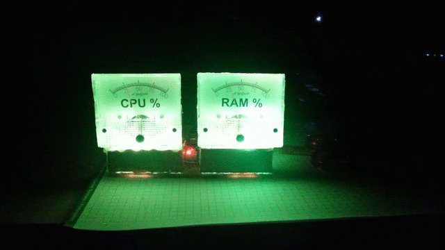
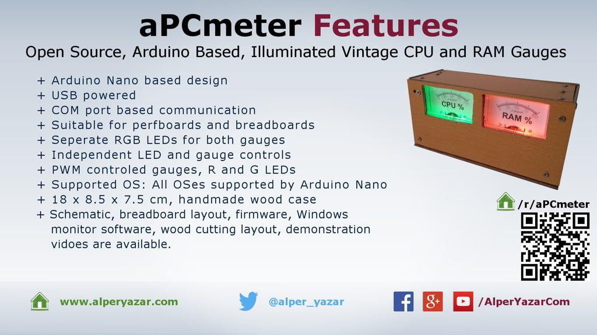

# aPCmeter

aPCmeter is an open source, Arduino Nano based, illuminated vintage looking CPU and RAM gauges box project. It is designed only just for fun. It shows CPU and RAM utilization of PC in analog manner.

This repository is dedicated to aPCmeter device including drawings of wood case, Arduino firmware, circuit schematic. Necessary PC software is not given it this repository. Please check the project web page if there is any available PC software.

You can find all details on the project web page:

[https://www.alperyazar.com/project/apcmeter/](https://www.alperyazar.com/project/apcmeter/)

**THIS PROJECT IS PUBLISHED UNDER CC BY-NC-SA 4.0 LICENSE**

**AS IS, ABSOLUTELY NO WARRANTY**

## Folders

* `Board`: Contains schematic and bread board layout drawn by using Fritzing, BOM and Arduino Nano pinout diagram.

* `Firmware`: Contains Arduino software and its documentation generated by using Doxygen. Doxygen codes are also included there.

* `HowToBuild`: Contains detailed building guide for the hardware.

* `Gauge`: Contains drawings of CPU and RAM gauges in both vector and static formats. All vector drawings were done in Inkscape.

* `Wood`: Contains wood cut sketch prepared by using simple-cutting-software-x. You may take these drawings as a reference if you are planning to build your own wood case.

*You are always welcomed to contact me.*
