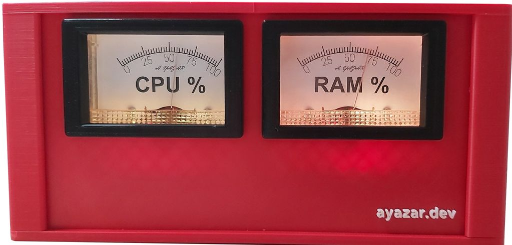

# aPCmeter

aPCmeter is an open source, Arduino Nano based, illuminated vintage looking CPU and RAM gauges box project. It was designed only just for fun. It shows CPU and RAM utilization of PC in an analog manner.

**AS IS, ABSOLUTELY NO WARRANTY**

## v2, 2023

7 years after the first design (v1, 2016), my friend [Erdal](https://www.linkedin.com/in/erdal-mehmetcik-7470363a/) who is a 3D printer enthusiast designed and printed an ABS box for me (with [Bambu X1c](https://bambulab.com/en/x1)) and I did a *retrofit*.

## v2, 2023 vs v1, 2016

The only difference between v2 and v1 is the box design. When I created the project in 2016, 3D printers were not widespread. Therefore, I made a wooden box. In 2023, the box is upgraded to a 3D printed ABS. The electronics, firmware and software are the same.

## Folders

* `3D`: `.stl` files of the new box (v2). You can create your own copy with a 3D printer.

* `Board`: Contains schematic and bread board layout drawn by using Fritzing, BOM and Arduino Nano pinout diagram.

* `Firmware`: Contains Arduino software and its documentation generated by using Doxygen. Doxygen codes are also included there.

* `HowToBuild`: Contains detailed building guide for the hardware.

* `Gauge`: Contains drawings of CPU and RAM gauges in both vector and static formats. All vector drawings were done in Inkscape.

* `Software`: Contains PC software (Python script + `.exe`) required getting CPU and RAM usages from OS and sending them to aPCmeter.

* `Wood`: Contains wood cut sketch prepared by using simple-cutting-software-x. You may take these drawings as a reference if you are planning to build your own wood case.

## Building your own aPCmeter

This is a basic project. First read `HowToBuild`. The schematic is in `Board` directory. The necessary Arduino firmware is in `Firmware` directory with a very detailed documentation. An example PC software is in `Software` directory. If you want to print your own plastic box, then check `3D` directory or for check `Wood` directory to make your own wooden box.
